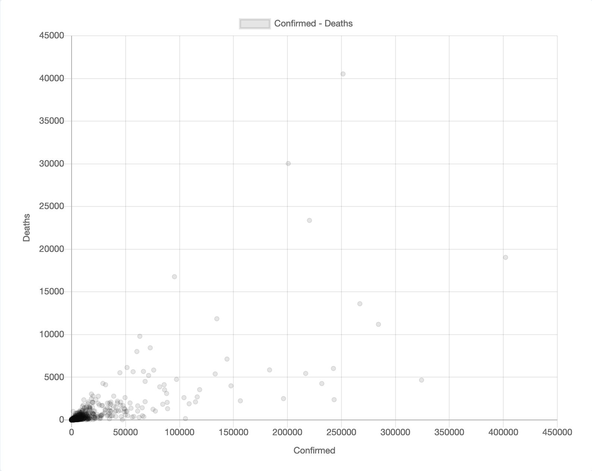

# Visualización de Datos II
**Puede acceder a la demo de la aplicación en [http://edu.ajmonfue.me/adm-2/](http://edu.ajmonfue.me/adm-2/)**

## Enunciados
### 1. Lee el documento "Why scientists need to be better at data visualizationURL" desde la sección "Ruinous rainbows" hasta el final del mismo. Haz un resumen de no más de una página con las conclusiones que obtienes.

El color es una herramienta muy útil en la representación de los datos, sin embargo, si se hace un mal uso, que es lo común, puede complicar el entendimiento o mostrar información distinta a la deseada.
Una de las malas prácticas más comunes es usar la escala de colores del arco iris, la cual puede tener distintas interpretaciones debido a la percepción, entiendo o capacidad fisiológica  del espectador (orden de los colores, daltonismo), para lo cual se han ideado otras escalas (Cividis, Viridis, Parula), los cuales están diseñados para representar mejor los datos subyacentes, facilitar la lectura o, como el caso de Cividis, para ser legible por personas daltónicas. Sin embargo, a pesar de las nuevas escalas, la escala de colores del arco iris sigue siendo la predominante, puesto que desde los iniciales ha sido la más común y a la que la gente está acostumbrada.

### 2. Para el framework de visualización desarrrollado en la práctica anterior, incorpora las modificaciones planteadas por el profesor durante la sesión de evaluación, entre ellas, el ajuste dinámico de los ejes en función del conjunto de datos a representar.

#### Mejoras realizadas
##### Incorporación de librería JS para la representación de las gráficas
Se ha implementada esta mejora con el fin de mejorar la usabilidad y otorgar al usuario una experencia interactiva con la gráfica. Para ello se ha incorporado [`Chart.js`](https://www.chartjs.org/) a la implementación del cliente y añadido la implementación para generar los gráficos análogos a los generados por Matplotlib. Dichos gráficos, creados con Chart.js, son generados a partir de los mismos datos usados por Matplotlib.

# Se permite seleccionar múltiples campos asociados a un eje
Se permite seleccionar múltiples campos en ambos ejes, pero no a la vez. Ésto es aplicable para las gráficas de líneas y barras.

En el caso de seleccionarlos en el eje `X`, estos representarán cada posición de dicho eje; y el campo seleccionado del eje `Y` represetará, por un lado, el campo de agrupación de los datos, y por otro, por cada valor del campo, se creará una serie/grupo en la gráfica.

**Datos**: https://raw.githubusercontent.com/CSSEGISandData/COVID-19/master/csse_covid_19_data/csse_covid_19_time_series/time_series_covid19_recovered_global.csv

| *Múltiples campos en el eje `X` (Chart.js)* | *Múltiples campos en el eje `X` (Matplotlib)* |
|---|---|
|  |  |

Para el caso del eje `Y`, cada campo seleccionado representará un serie/grupo. Y los valores del campo del eje `X` serán las posiciones de dicho eje.

**Datos**: https://raw.githubusercontent.com/CSSEGISandData/COVID-19/master/csse_covid_19_data/csse_covid_19_daily_reports/07-16-2020.csv

| *Múltiples campos en el eje `Y` (Chart.js)* | *Múltiples campos en el eje `Y` (Matplotlib)* |
|---|---|
|  |  |

##### Adición de gráfica de dispersión (Scatter)
Se ha incorporado este tipo de gráficas para comparar dos variables distintas, una variable por eje, por lo que a pesar que en el formulario de cliente se pueda seleccionar múltiples cambios, para la presentación de este tipo de gráficas sólo se tomará en cuenta el primer campo especificado para cada eje. 

**Datos**: https://raw.githubusercontent.com/CSSEGISandData/COVID-19/master/csse_covid_19_data/csse_covid_19_daily_reports/07-16-2020.csv

| *Ejemplo gráfica de dispersión (Chart.js)* | *Ejemplo gráfica de dispersión (Matplotlib)* |
|---|---|
|  |  |

##### Indicar la función a ejecutar en la agrupación de datos
Actualmente, la función que el script en python ejecutaba para la agrupación de los datos era la suma, sin embargo Matplotlib implementa tambien otras; producto, mínimo, máximo, primera ocurrencia y última ocurrencia. Para lo cual, con el fin de indicar la función de agrupación a usar, se ha añadido un nuevo argumento al script, `--group-by-func`, el cual pude tener uno de los siguientes valores: `sum`, `prod`, `min`, `max`, `first` o `last` y  por defecto es `sum`. De igual forma, se ha añadido en el formulario del cliente un selector asociado a este nuevo argumento.

## Mejoras planteadas
* Añadir campo al formulario del cliente para indicar la columna de agrupación, útil para las gráficas de dispersión.

